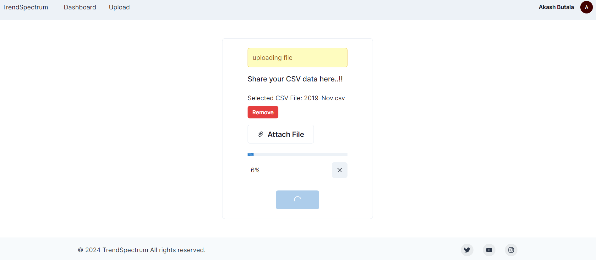
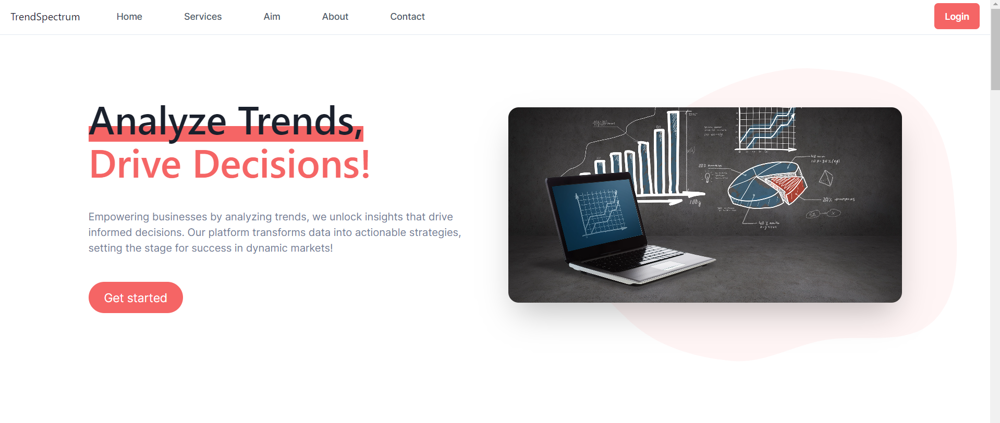
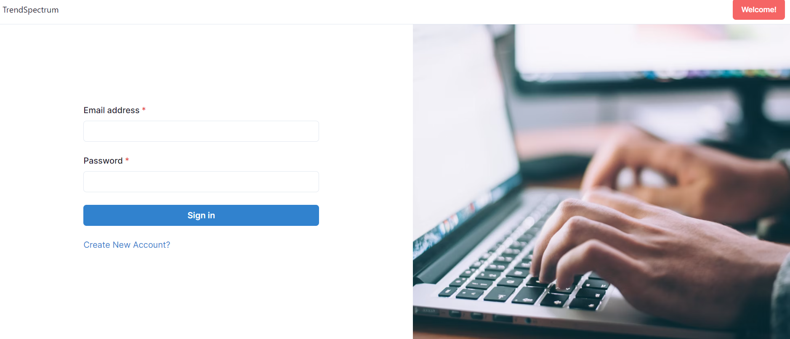
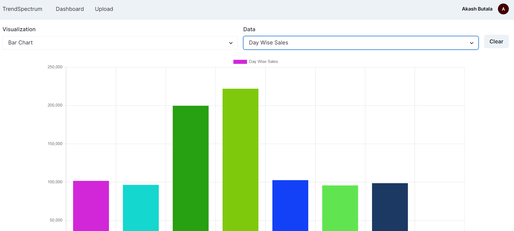

TrendSpectrum is a webapp that allow vendors to effortlessly upload data, analyze trends, and get actionable insights. By democratizing access to advanced analytics, TrendSpectrum facilitates informed decision-making, enabling vendors to optimize strategies and capitalize on emerging opportunities. With its intuitive interface and powerful features, TrendSpectrum revolutionizes data-driven decision-making, driving innovation and business growth in competitive markets. Moreover, utilized Amazon Web Services (AWS) tools, specifically AWS S3 (Simple Storage Service) and EMR (Elastic MapReduce), to efficiently handle a large dataset totaling 20GB. Employed PySpark, a Python library for parallel processing with Apache Spark, that significantly reduced the time it took to process the data by an impressive 60%. 

### Getting Started

First, run the development server:

```bash
npm run dev
# or
yarn dev
# or
pnpm dev
# or
bun dev
```

Open [http://localhost:3000](http://localhost:3000) with your browser to see the result.

### Working Snapshots

   
